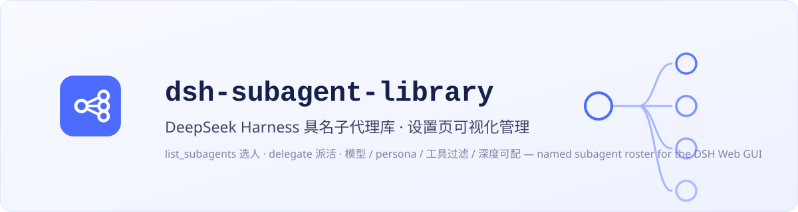
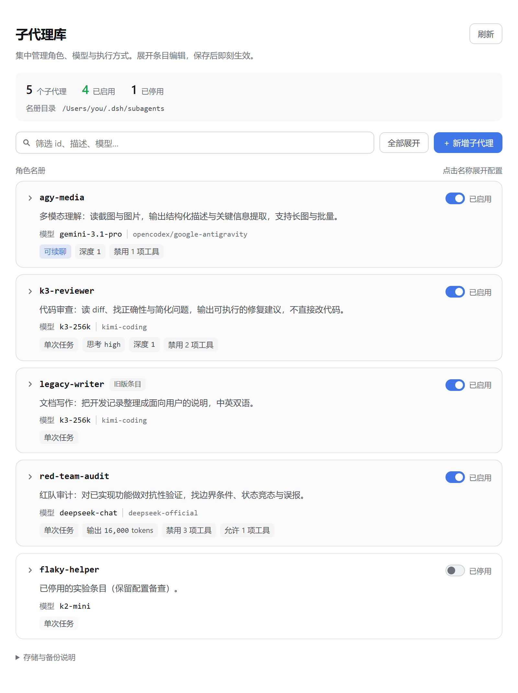
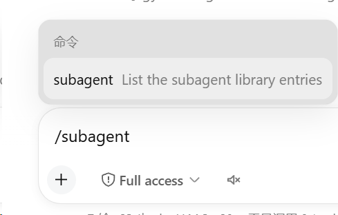
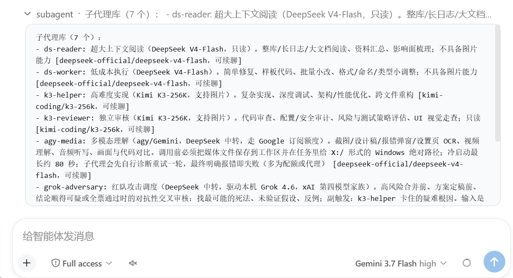

# dsh-subagent-library

**[中文](./README.md) | English**

<p align="center">
  
</p>

<p align="center">
  
  
  
</p>

## Overview

A named subagent roster plugin for the [DeepSeek Harness](https://github.com/deepseek-ai/deepseek-harness) (DSH) Web GUI: turn your recurring roles (code review, red team, multimodal understanding…) into a persistent named roster (model + persona + tool filter). Then **just tell the main agent "do this with xxx"** — the model picks and dispatches through two tools by itself:

- `list_subagents` — lists roster entries (id / role description / model) so the model can pick a suitable one;
- `delegate` — dispatches work by `library_id`: foreground wait, background one-shot, or a continuable (resumable) subagent, per the entry's configuration.

Available in every conversation (any agent preset), **no slash command needed**; the `/subagent` command is only for humans to peek at the roster in the command palette.

Adding entries needs no hand-written config either: ask the main agent to do it, or edit visually in the settings page. Since 0.3 the roster is stored as **one YAML file per named subagent** (default directory `~/.dsh/subagents/`), hot-reloaded, comment-friendly and versionable per file.

> Distinction from the official capabilities: the official `subagent` tool dispatches ad-hoc tasks (you describe the task each time), and the official `list_agents` lists *running* child instances; this plugin maintains a **persistent named roster** (edited visually in a settings page, hot-reloaded). The model picks an entry with `list_subagents` and dispatches by id with `delegate`.

> **Upgrading from 0.2.x?** Since 0.3 the roster is directory-backed (one YAML file per subagent). Your legacy config **migrates automatically**; after verifying it, clear the old `entries` section for your host generation. [MIGRATION.md](./MIGRATION.md) documents the config locations, failure/retry behavior, and rollback limits; [CHANGELOG.md](./CHANGELOG.md) lists all changes.

## Screenshots

<p align="center">
  <br>
  <em>Cards start collapsed for a quick view of roles, models and execution settings. Filter and expand to edit; enable-state changes take effect after saving.</em>
</p>

<p align="center">
  <br>
  <em>The <code>/subagent</code> command (quick roster viewer)</em>
</p>

<p align="center">
  <br>
  <em>Roster output example: one-line role description + model route + continuable marker per entry</em>
</p>

## Configuration

Since 0.3 the roster is a directory with **one file per named subagent** (hot-reloaded, no restart needed):

```
~/.dsh/subagents/
  k3-reviewer.yaml     # id = file name
  glm-reader.yaml
  _backups/            # backup area: copy the original here before editing (ignored by the plugin)
  README.md            # optional: conventions for agents operating in this directory
  ...
```

> **Backup convention** — the plugin never auto-backs up. By convention, agents (or humans) copy the original file into `_backups/` before editing (suggested name `<id>.<yyyymmdd-hhmm>.yaml`). Anything `_`-prefixed is treated as non-roster content and silently ignored.

Where the plugin-level options live **depends on the host version**. Use one of these two shapes:

**DSH ≤0.1.6:** edit `~/.dsh/settings.yaml`.

```yaml
subagent-library:
  entriesDir: ~/.dsh/subagents
  subagentProvider: spawn
  # entries: (optional, legacy) the 0.2.x inline roster remains a read-only
  # fallback throughout 0.3.x — files win; removal planned for 0.4
```

**DSH ≥0.1.7:** edit the web profile's `cordis.patch.yml`, under `config` on its `- id: subagent-library` entry.

```yaml
- id: subagent-library
  config:
    entriesDir: ~/.dsh/subagents
    subagentProvider: spawn
    # entries: (optional, legacy) the 0.2.x inline roster remains a read-only
    # fallback throughout 0.3.x — files win; removal planned for 0.4
```

One entry file (`k3-reviewer.yaml`):

```yaml
description: Independent read-only review on Kimi K3-256K, with image walkthroughs
provider: kimi-coding
model: k3-256k
persona: |
  You are an independent review agent running on Kimi K3-256K…
toolFilter:
  deny: [write, edit, todo_write, create_goal, update_goal, subagent, subagent_fork, send_message, interrupt_agent, workflow, ralph, list_subagents, delegate]
maxDepth: 1
backgroundMode: continuable
```

Entry fields:

| Field | Required | Notes |
|---|---|---|
| `id` (= file name) | yes | `<id>.yaml`; the id must match `[a-z0-9][a-z0-9-]*`, length ≤ 64 (Windows reserved device names con/nul/aux… are rejected) |
| `description` | yes | Role description, shown to the model by `list_subagents` |
| `provider` | no | **LLM route** (e.g. `deepseek-official`, `kimi-coding`); defaults to the caller's default |
| `model` | no | LLM model id; defaults to the caller's session model |
| `reasoningEffort` | no | Thinking effort: adapter-owned id (e.g. `max` / `high` / `medium` / `low`); empty follows the parent session default. Rides the official `agentOptions.reasoningEffort` override; when the child model route differs, the harness auto-drops the inherited effort, so unset values never leak across models. Only id-shaped values (alphanumerics and `._-`) are accepted; anything else is rejected on save |
| `subagentProvider` | no | **Subagent transport** (a `ctx.subagents` provider such as `spawn`); defaults to the plugin-level default `spawn` |
| `maxTokens` | no | Subagent output cap |
| `persona` | no | Subagent system prompt. Personas go through strict `{{…}}` template interpolation (same semantics as deployment personas) — an unregistered variable (e.g. `{{user}}`) fails child activation |
| `toolFilter` | no | `allow`/`deny` tool-name lists (deny write-class tools for read-only roles). **Read-only/restricted roles should also deny `list_subagents`/`delegate`** so children are not taught by the global prompt to re-delegate in a chain. Names are resolved against the **calling session's restrictable set** at delegation (not "visibility"): names that session cannot apply are ignored and annotated with the reason (`本会话不存在` / `本会话专属工具`) in the delegate result and the `list_subagents` catalog — one shared entry never fails a whole delegation because a session lacks a tool. **An `allow` list that no name applies to refuses the delegation** (otherwise "keep only these" would silently become "keep nothing"). Registries without `view()` fall back to visibility, where scope-local names still make delegation fail loudly. Saves are not pre-validated |
| `maxDepth` | no | Delegation depth cap; **when unset, defaults to 3 when the transport supports depthLimit** (aligned with the official subagent tool to prevent chained recursive delegation; the harness itself has no global depth cap). Transports without depthLimit stay uncapped |
| `backgroundMode` | no | `one-shot` (default, omitted in files) / `continuable` (resumable) |
| `enabled` | no | Write `enabled: false` to disable an entry (it stays visible in the directory and the settings page; `delegate` refuses it); omit or set `true` to enable |

**Broken files never brick the roster**: files that fail to parse or validate are skipped, and the reason is surfaced as diagnostics in `list_subagents`, the `/subagent` command, and the settings page; `.yaml`/`.yml` duplicate ids and wrongly-cased file names are reported the same way.

**Migrating from 0.2.x**: on first roster use, the old `entries` section is exported **entry by entry** to `<id>.yaml` (ids with an existing file are skipped — hand-written files are never overwritten); legacy copies are KEPT as a rollback, and files take precedence. When saving through the settings page, an unchanged canonical `.yaml` row is skipped so its hand-written comments stay intact; an unchanged `.yml` row is still rewritten as generated `.yaml` and loses its comments. A write/convergence failure returns HTTP 500 and may leave a partial result. If the canonical `.yaml` skip path cannot sweep a same-id `.yml`, the save returns 200 with a warning and the duplicate diagnostic remains until a retry succeeds. Once confirmed, clear only the legacy `entries` key and keep the other keys on that same config row (reading is removed in 0.4).

The 0.2.8 legacy `entries` fallback is for DSH ≤0.1.6 only; on DSH ≥0.1.7 the plugin cannot be downgraded by itself. Host downgrade and restoration of `settings.yaml.imported` data are unverified, so no downgrade sequence is prescribed. To restore roster content, use your own `_backups/` copies and verify them manually.

> Mind the two provider concepts: `provider` is the LLM route (`agentOptions.provider`),
> while `subagentProvider` is the subagent transport (`ctx.subagents` registration name, e.g. `spawn`/`fork`/`acp`).

## Host and desktop compatibility

`0.3.1` adapts to the SettingsForms mechanism introduced in DSH `0.1.7-rc.2`. On 2026-09-30, the development team additionally reported it working with DSH `0.2.0-rc.2` and the desktop client of the same version. The roster retains the 0.3 series directory-backed storage and migration rules; this documentation update does not migrate data again.

**0.3.2** adds English and Chinese names and descriptions to the plugin manager, following the client language. Roster and delegation behavior are unchanged. See [CHANGELOG.md](./CHANGELOG.md) for update notes.

The desktop client uses the Web plugin UI, so no separate desktop-specific package is needed. This compatibility statement reflects maintainer usage feedback. Online model calls still depend on each provider's configuration and service; a working settings page does not establish acceptance of every model or cross-platform scenario.

## Install

One command, from npm (recommended):

```sh
npx @deepseek-ai/dsh plugin --profile web add dsh-subagent-library
```

Then **restart `dsh web`** (stop the process, run `dsh web` again) and refresh the page.

Other install sources:

```sh
# From GitHub (git-hosted plugin; lib/ build artifacts are committed, no local build needed)
npx @deepseek-ai/dsh plugin --profile web add github:MaRi23333/dsh-subagent-library

# From a local checkout
git clone https://github.com/MaRi23333/dsh-subagent-library.git
cd dsh-subagent-library
pnpm install && pnpm run build
npx @deepseek-ai/dsh plugin --profile web add /absolute/path/to/dsh-subagent-library
```

> The repo commits `lib/` build artifacts, so git installs need no local build; after
> changing sources run `pnpm run build` and restart.
> Roster edits (files under `~/.dsh/subagents/`) are **hot-reloaded** — no restart.
>
> **Switching channels** — if you previously installed from GitHub or a local checkout and want npm-release upgrades, re-add with `npx @deepseek-ai/dsh plugin --profile web add dsh-subagent-library@latest` to force the latest npm version.

## Settings page

A **Subagent Library** page appears under Settings. **Each entry is a card, closed by
default**; click its name to open the editor.

- **Layered cards** separate the name and enable switch, a description of up to two lines,
  the model and provider, and a wrapping group of execution settings. Long names and model
  routes wrap without squeezing the description or hiding the switch.
- A **summary band** stays at the top of the page: entry / enabled / disabled / unsaved counts
  plus the roster directory.
- A **filter box** matches id, description, model and more; Expand/collapse all helps in a long
  roster.
- **Expanded**, fields are grouped as Overview (description) / Routing & execution (provider,
  model, transport, background mode, reasoning effort, depth, output cap) / Tools & prompt
  (denied tools, persona), with Revert / Delete / Save at the bottom. Fields use two columns
  in wider panels and one in narrow panels, with host light/dark themes and keyboard support.
- Toggling enable state creates a draft. The collapsed card exposes an unsaved badge and
  Revert / Save changes; the setting takes effect only after saving. Saving one entry does
  not submit other drafts, and Revert restores the entire saved entry.
- Disabled entries appear last; entries marked as legacy are promoted to files on save.
  Storage and backup details are available in a disclosure at the bottom of the page.

Saved changes are written back to `<id>.yaml` in the roster directory and hot-reloaded.

> **Security note:** the roster settings endpoint (`/subagent-library/api`) follows the
> DSH Web Host's local trust boundary — the plugin itself adds no separate authentication
> layer. If you bind DSH Web to a LAN, the public internet, or a reverse proxy, put proper
> authentication and access control in front of it; do not expose this endpoint to
> untrusted clients — subagent personas and configuration may contain internal working rules.

## Design notes

- Tools register on the **host plane**: no dependency on any agent preset, and switching presets never loses them;
- Dispatch goes through the standard `ctx.subagents` seam (providers such as `spawn`), so subagents keep harness semantics: approval pinned to never, sandbox inherited from the parent session, depth caps, continuable support;
- Entries are re-resolved from the roster directory on every operation (no cache, no watcher) — file edits take effect immediately; single-entry writes are atomic (temp file + rename with retries), concurrent writers are last-write-wins.

## Development

```sh
pnpm install
pnpm run typecheck
pnpm run build   # host: lib/index.js; client: lib/client.js
```

- Dev dependencies remain pinned to DSH `0.1.0-rc.6` (see package.json devDependencies); this is not the current runtime host version. See "Host and desktop compatibility" above for current support and usage feedback. If the interfaces drift on other versions, adjust against the corresponding tag of the [deepseek-harness repo](https://github.com/deepseek-ai/deepseek-harness).

## License

[MIT](./LICENSE). Third-party license notices for code inlined into the build artifacts are in [THIRD_PARTY_NOTICES.md](./THIRD_PARTY_NOTICES.md).

This is an independent community project, not affiliated with or endorsed by DeepSeek; the `DeepSeek Harness` name is used only to identify the compatible platform.
