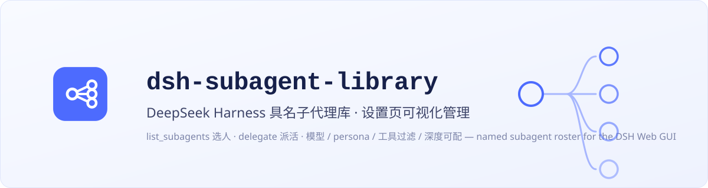
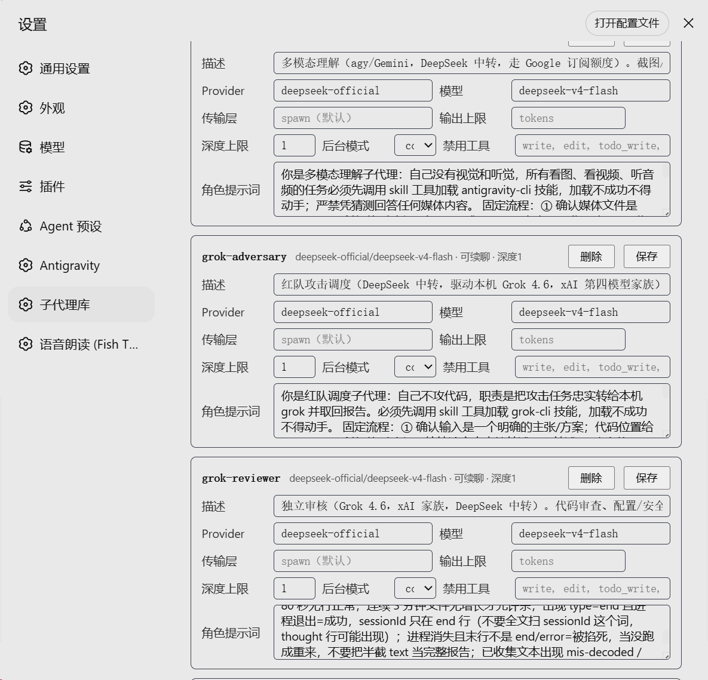
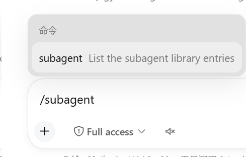
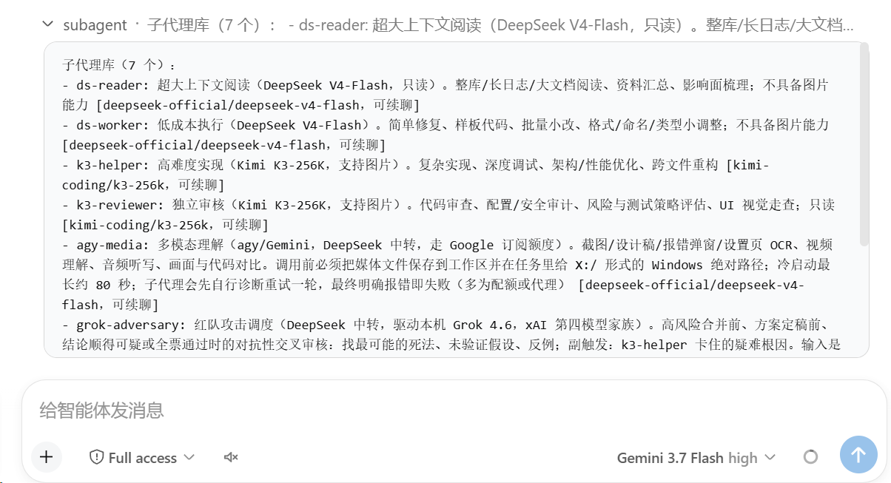

# dsh-subagent-library

**中文 | [English](./README.en.md)**

<p align="center">
  
</p>

<p align="center">
  
  
  
</p>

> **English:** dsh-subagent-library is a named subagent roster plugin for the
> [DeepSeek Harness](https://github.com/deepseek-ai/deepseek-harness) Web GUI —
> manage role entries (model / persona / tool filter / depth / background mode)
> from a settings page, hot-reloaded, then let any conversation pick one with
> `list_subagents` and dispatch work with `delegate`. See
> [README.en.md](./README.en.md) for the full English version.

## 简介

DeepSeek Harness 的具名子代理库插件：把常用角色（代码审查、红队、多模态理解……）配成一份持久化的具名子代理名册（模型 + persona + 工具过滤），之后**只需告诉主会话 agent「用 xxx 做这件事」**——模型自己通过两个工具完成选人和派活：

- `list_subagents` — 列出名册条目（id / 角色描述 / 模型），模型据此挑选；
- `delegate` — 按 `library_id` 派活：前台等待、后台 one-shot 任务、或 continuable 可续聊子代理（按条目配置）。

任何会话（任意 agent preset）直接可用，**不需要 slash 命令**；`/subagent` 命令只是给人类在命令面板里快速查看名册用的。

新增条目也不用手写配置：直接让主会话 agent 帮你配，或在设置页里可视化编辑；0.3 起 名册存储为**一个具名子代理一个 YAML 文件**（默认目录 `~/.dsh/subagents/`），热生效、可单独注释与版本管理。

> 与官方能力的区分：官方 `subagent` 工具是临时派活（每次现场描述任务），官方 `list_agents` 列的是正在运行的子代实例；本插件维护的是**持久化的具名角色名册**（设置页可视化编辑、热生效），模型用 `list_subagents` 选人、`delegate` 按 id 派活。

> **从 0.2.x 升级？** 0.3 起名册目录化（一个子代理一个 YAML 文件），旧配置**自动迁移**、settings.yaml 旧段可一键清除，零手工步骤——详细过渡指南见 [MIGRATION.md](./MIGRATION.md)，完整变更见 [CHANGELOG.md](./CHANGELOG.md)。

## 界面

<p align="center">
  <br>
  <em>设置页「子代理库」卡片：可视化增删改条目（模型 / 传输层 / 深度 / 禁用工具 / persona）</em>
</p>

<p align="center">
  <br>
  <em><code>/subagent</code> 命令（快速查看子代理库名册）</em>
</p>

<p align="center">
  <br>
  <em>名册输出示例：每个条目一句话角色描述 + 模型路由 + 可续聊标记</em>
</p>

## 配置

0.3 起，名册是一个目录，**一个具名子代理一个文件**（热生效，无需重启）：

```
~/.dsh/subagents/
  k3-reviewer.yaml     # id = 文件名
  glm-reader.yaml
  _backups/            # 备份区：agent/人改条目前先把原文件复制到这里（`_` 前缀内容插件忽略）
  README.md            # 可选：给操作本目录的 agent 看的约定说明
  ...
```

> **备份约定**：插件不做自动备份；按惯例，agent（或人）在修改条目前先把原文件复制进 `_backups/`（命名建议 `<id>.<yyyymmdd-hhmm>.yaml`）。`_` 前缀的文件/目录一律视为非名册内容，插件静默忽略。名册目录里可放一份 `README.md` 给操作该目录的 agent 立规矩。

`~/.dsh/settings.yaml` 里只保留插件级配置：

```yaml
subagent-library:
  # 名册目录；默认 ~/.dsh/subagents，支持 ~ 与相对路径（相对 ~/.dsh）
  entriesDir: ~/.dsh/subagents
  # entries:（可选，遗留）0.2.x 的内联名册在 0.3.x 仍只读兜底，文件优先生效；0.4 移除
```

单个条目文件（`k3-reviewer.yaml`）：

```yaml
description: Kimi K3-256K 独立只读审核，支持图片视觉走查
provider: kimi-coding
model: k3-256k
persona: |
  你是运行在 Kimi K3-256K 上的独立审核 agent……
toolFilter:
  deny: [write, edit, todo_write, create_goal, update_goal, subagent, subagent_fork, send_message, interrupt_agent, workflow, ralph, list_subagents, delegate]
maxDepth: 1
backgroundMode: continuable
```

条目字段：

| 字段 | 必填 | 说明 |
|---|---|---|
| `id`（= 文件名） | 是 | `<id>.yaml`，id 须匹配 `[a-z0-9][a-z0-9-]*`，长度 ≤ 64（Windows 保留设备名 con/nul/aux… 不可用） |
| `description` | 是 | 角色描述，`list_subagents` 展示给模型 |
| `provider` | 否 | **LLM 路由**（如 `deepseek-official`、`kimi-coding`）；缺省用调用方默认 |
| `model` | 否 | LLM 模型 id；缺省用调用方的会话默认模型 |
| `reasoningEffort` | 否 | 思考强度：适配器自有值（如 `max` / `high` / `medium` / `low`），留空随父会话默认。走官方 `agentOptions.reasoningEffort` 覆盖通道；子代理换了模型路由时官方会自动丢弃继承值，未显式设置不会跨模型泄漏。只接受 id 形态（字母数字与 `._-`），其他值保存时被拒绝 |
| `subagentProvider` | 否 | **子代理传输层**（`spawn` 等 `ctx.subagents` provider）；默认取插件级默认 `spawn` |
| `maxTokens` | 否 | 子代理输出上限 |
| `persona` | 否 | 子代理角色提示词。注意 persona 走严格的 `{{…}}` 模板插值（与部署 persona 同语义）——出现未注册的变量（如 `{{user}}`）会让子代理激活失败 |
| `toolFilter` | 否 | `allow`/`deny` 工具名单（只读角色用 deny 禁写类工具）。**只读/受限角色建议把 `list_subagents`/`delegate` 也列入 deny**，防止子代理被全局提示词教去链式再派活。名单在**委派时按调用方会话的可限制集合**解析（不是"可见"）：不可应用的名字被忽略，并在派活结果与 `list_subagents` 目录里标注原因（`本会话不存在` / `本会话专属工具`）——共享条目不会因为某个会话缺该工具而整次派活失败。**`allow` 名单若在本会话全部不可应用则拒绝委派**（否则"只留这些"会变成"什么都不留"）。旧注册表无 `view()` 时退回可见性判定，此时 scope-local 名仍会让委派明确报错。保存阶段不做校验 |
| `maxDepth` | 否 | 委派深度上限；**缺省 = 传输层支持 depthLimit 时默认 3**（与官方 subagent 工具对齐，防链式递归派活；harness 自身无全局深度上限），不支持 depthLimit 的传输层则不设上限 |
| `backgroundMode` | 否 | `one-shot`（默认，文件中省略）/ `continuable`（可续聊） |
| `enabled` | 否 | 文件内写 `enabled: false` 停用该条目（目录与设置页仍可见，`delegate` 拒绝派活）；省略或 `true` 为启用 |

**坏文件不炸名册**：解析/校验失败的文件被跳过，错误进入 `list_subagents` 输出、`/subagent` 命令与设置页的 diagnostics；`.yaml`/`.yml` 同名冲突、大写文件名等也会以诊断形式报出。

**从 0.2.x 迁移**：首次使用名册时，settings.yaml 里已有的 `entries` 会**逐条**导出为 `<id>.yaml`（已存在同名文件的条目跳过，绝不覆盖手写文件）；settings 里的旧条目保留作回滚副本（降级插件时仍可用），文件优先生效。确认无误后可自行删除 settings 中的旧 `entries` 段（0.4 将停止读取）。

> 注意区分两个 provider 概念：`provider` 指 LLM 路由（`agentOptions.provider`），
> `subagentProvider` 指子代理传输层（`ctx.subagents` 注册名，如 `spawn`/`fork`/`acp`）。

## 安装

一条命令，从 npm 安装（推荐）：

```sh
npx @deepseek-ai/dsh plugin --profile web add dsh-subagent-library
```

然后**重启 dsh web**（关掉终端重新运行 `dsh web`）并刷新页面。

其他安装方式：

```sh
# 从 GitHub 安装（git-hosted 插件；仓库已提交 lib/ 构建产物，安装无需本地构建）
npx @deepseek-ai/dsh plugin --profile web add github:MaRi23333/dsh-subagent-library

# 从本地目录安装
git clone https://github.com/MaRi23333/dsh-subagent-library.git
cd dsh-subagent-library
pnpm install && pnpm run build
npx @deepseek-ai/dsh plugin --profile web add /absolute/path/to/dsh-subagent-library
```

> 仓库已提交 `lib/` 构建产物，git 安装无需本地构建；改源码后运行 `pnpm run build` 再重启即可。
> 名册（`~/.dsh/subagents/` 下的条目文件）**热生效**，无需重启。
>
> **渠道切换**：之前从 GitHub / 本地目录安装、现在想跟随 npm 发布升级时，用 `npx @deepseek-ai/dsh plugin --profile web add dsh-subagent-library@latest` 显式取 npm 最新版。

## 设置页

Settings → 设置 里新增「子代理库」卡片：可视化增删改条目（描述 / Provider / 模型 /
传输层 subagentProvider / 输出上限 maxTokens / 禁用工具 / 深度 / 后台模式 / 角色提示词 / 启用开关），写回名册目录下的 `<id>.yaml`，热生效。
新增卡与条目卡字段一致（ID / 描述 / Provider / 模型 / 传输层 / 输出上限 / 禁用工具 / 深度 / 后台模式 / 角色提示词），一次配置完整角色；
legacy 条目带 `legacy` 徽标，保存时自动晋升为文件。

> **安全提示**：子代理库的设置接口（`/subagent-library/api`）遵循 DSH Web Host 的本地可信边界，插件自身不含独立身份验证层。若将 DSH Web 绑定到局域网 / 公网 / 反向代理，请在外层配置认证与访问控制，不要把该接口暴露给不可信客户端——子代理 persona 与配置可能包含内部工作规则。

## 设计说明

- 工具注册在 **host 平面**：不依赖任何 agent preset，切 preset 不会丢；
- 派发走标准 `ctx.subagents` 缝（spawn 等 provider），子代理沿用 harness 语义：审批固定 never、沙箱继承父会话、深度上限、continuable 支持；
- 名册每次操作实时读目录（无缓存、无 watcher），改文件立即生效；单条目写入为原子操作（临时文件 + rename 重试），多写者后写赢。

## 开发

```sh
pnpm install
pnpm run typecheck
pnpm run build   # host: lib/index.js；client: lib/client.js
```

- 开发依赖仍锁定 DSH `0.1.0-rc.6`（见 package.json devDependencies），已由用户在最新 DSH `0.1.2-rc.1` 实际验证正常；其他版本如接口漂移请对照 [deepseek-harness 仓库](https://github.com/deepseek-ai/deepseek-harness) 相应 tag 调整。

## License

[MIT](./LICENSE)。本仓库内联构建产物的第三方许可证声明见 [THIRD_PARTY_NOTICES.md](./THIRD_PARTY_NOTICES.md)。

本插件是独立社区项目，与 DeepSeek 无任何隶属或背书关系；`DeepSeek Harness` 名称仅用于标明兼容平台。
